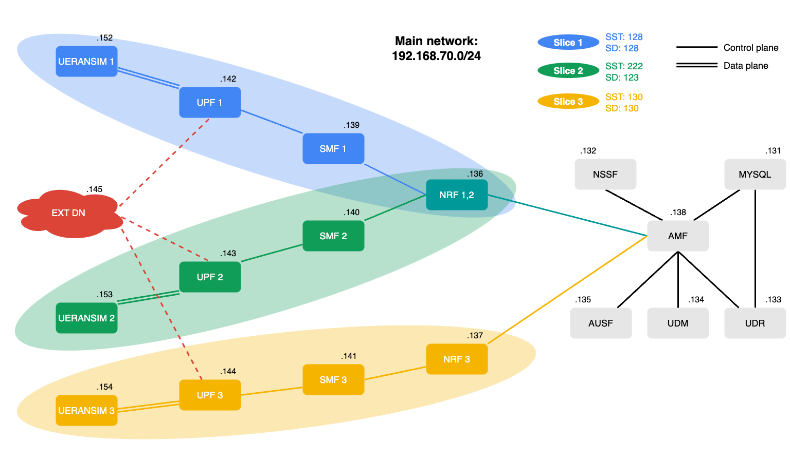
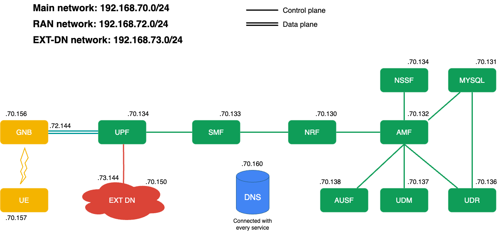

# Softwarize and Virtualized Mobile Networks Project - Emulating 5G Core with OAI
#### Morandin Marco (228160) - Soldera Marco (226651)

The assignment is to reproduce [this](https://github.com/fabrizio-granelli/comnetsemu_5Gnet) architecture made with Open5GS with the dockerized version of OpenAirInterface 5G Core Network and Mininet to simulate latency and limited bandwidth of the links.

## Installation
Go to the root folder of the project and run:
```
./docker-pull.sh
```
Now every needed container is downloaded and ready to run the project.

## Run Docker Compose version
The version in docker compose is the one taken by the [official OAI repository](https://gitlab.eurecom.fr/oai/cn5g/oai-cn5g-fed) and is fully working with 3 slices and 3 UEs simulated by UERANSIM.

The scheme is the following:


To try it, go to the ```docker-compose``` folder and run the following commands:
```
docker-compose -f docker-compose-slicing-basic.yaml up
```
When the previous command starts logging from the containers in another terminal run:
```
docker-compose -f docker-compose-ran-ueransim.yaml up
```

#### Testing Scenario
To test this configuration you can enter in the Ext-Dn container and ping one of the UERANSIM User Equipments or vice versa with:
```
docker exec -it oai-ext-dn ping -c 4 [UE IP address]
```
or
```
docker exec -it ueransim[slice number] ping -c 4 -I uesimtun0 8.8.8.8
```
With ```docker logs [container name]``` you can check all the logs related to every network function.

#### IP Table
| Container             |   IP Address   |
| ----------------------|--------------- |
| mysql                 | 192.168.70.131 |
| oai-nssf              | 192.168.70.132 |
| oai-udr               | 192.168.70.133 |
| oai-udm               | 192.168.70.134 |
| oai-ausf              | 192.168.70.135 |
| oai-nrf-slice12       | 192.168.70.136 |
| oai-nrf-slice3        | 192.168.70.137 |
| oai-amf               | 192.168.70.138 |
| oai-smf-slice1        | 192.168.70.139 |
| oai-smf-slice2        | 192.168.70.140 |
| oai-smf-slice3        | 192.168.70.141 |
| oai-upf-slice1        | 192.168.70.142 |
| oai-upf-slice2        | 192.168.70.143 |
| oai-upf-slice3        | 192.168.70.144 |
| oai-ext-dn            | 192.168.70.145 |
| ueransim gNB 1        | 192.168.70.152 |
| ueransim gNB 2        | 192.168.70.153 |
| ueransim gNB 3        | 192.168.70.154 |
| UE 1                  | 12.2.1.2       |
| UE 2                  | 12.1.1.130     |
| UE 3                  | 12.1.1.2       |

#### Known Issues
- When a UPF-VPP is used the related SMF crashes
- Other RAN simulators give errors on startup

#### Shutdown Scenario
To stop the simulation press Ctrl-C and run the following commands in the respective terminals:
```
docker-compose -f docker-compose-slicing-basic.yaml down
docker-compose -f docker-compose-ran-ueransim.yaml down
```

## Run Mininet version (RAN not working)
The Mininet version is a basic configuration compared to the one in Docker Compose. The scenario is ran in comnetsemu. We made this basic configuration to test every container and the result is that UERANSIM has some compatibility problems with Mininet. The Core Network is fully working but can't be tested completely.

The scheme is the following:


To start the scenario from the root folder of the repository launch:
```
sudo python3 run_net.py
```

#### Testing Scenario
The first test to is could be to check the reachability of the containers with ping:
```
docker exec -it [conainer name] ping -c 4 [target IP or FQDN]
```
or from the UE:
```
docker exec -it ue_srv ping -c 4 -I uesimtun0 8.8.8.8
```
or from EXT-DN to UE:
```
docker exec -it ext_dn_srv ping -c 4 12.1.1.2
```

Then to check that the traffic follows the correct path you can run:
```
./start_tcpdump.sh upf
```

The last test that can be made is the bandwidth test between an arbitrary couple of containers or between two UE if created:
```
docker exec -it [container dev_test name] /bin/bash
iperf3 -c [source IP] -B [dest IP] -t 5
```

#### IP Table
| Container             |   IP Address   |
| ----------------------|--------------- |
| dns                   | 192.168.70.160 |
| mysql                 | 192.168.70.131 |
| oai-nssf              | 192.168.70.134 |
| oai-udr               | 192.168.70.136 |
| oai-udm               | 192.168.70.137 |
| oai-ausf              | 192.168.70.138 |
| oai-nrf               | 192.168.70.130 |
| oai-amf               | 192.168.70.132 |
| oai-smf               | 192.168.70.133 |
| vpp-upf      (N4)     | 192.168.70.134 |
| vpp-upf      (N3)     | 192.168.72.144 |
| vpp-upf      (N6)     | 192.168.73.144 |
| oai-ext-dn   (to UPF) | 192.168.73.145 |
| oai-ext-dn   (to s1)  | 192.168.70.150 |
| ueransim gNB (to UPF) | 192.168.72.141 |
| ueransim gNB (to s1)  | 192.168.70.156 |
| UE      (from EXT-DN) | 12.1.1.2       |
| UE           (to s1)  | 192.168.70.157 |

#### Known Issues
- Actually only UPF of VPP type works with Mininet
- All the images can't easy be deployed on ARM CPUs
- Other RAN simulators (gnbsim, oai-ran) than UERANSIM can't easily run without errors

#### Shutdown Scenario
To shutdown all the scenario type ```exit``` in the console of Mininet.
